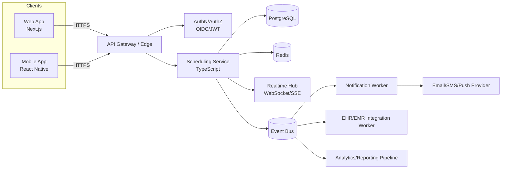
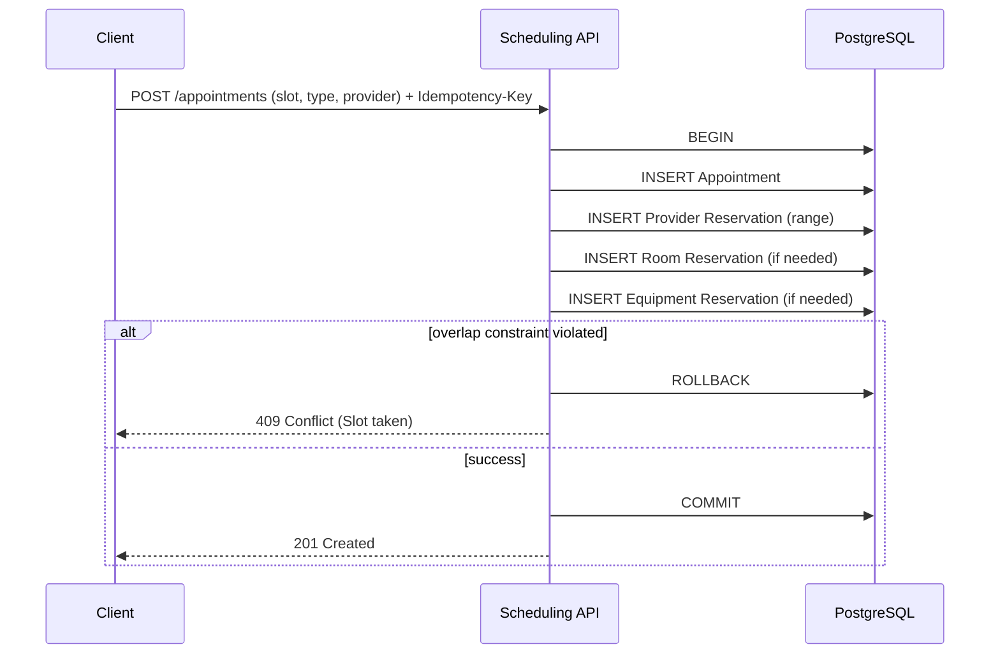

# Multi-Clinic Appointment Scheduling System — Technical Design (Assignment 4)

## 1. System Overview

### 1.1 Problem Statement

Design a scheduling system for a healthcare organization that:

* Supports **500 clinics**
* Handles **50,000 appointments/day**
* Supports **real-time availability updates**
* Works across **web + mobile**
* Handles **complex scheduling rules**:

  * provider availability
  * room booking
  * equipment constraints
  * buffers (before/after)
  * preferences and exceptions

Healthcare scheduling is less about “calendar UI” and more about **correctness under concurrency**, **auditability**, **time-zone correctness**, and **patient safety**. A “mostly correct” scheduler is not acceptable: double bookings or incorrect availability directly impacts care delivery.

### 1.2 Goals

**Functional**

* Create/reschedule/cancel appointments.
* Show availability for providers and clinics in near real-time.
* Enforce resource constraints (provider/room/equipment).
* Support appointment types with different durations and buffer rules.
* Support exceptions (PTO, holidays, maintenance blocks).

**Non-functional**

* **Correctness**: prevent double-booking.
* **Low latency**: availability queries should feel interactive.
* **Resilience**: degraded behavior must still be safe.
* **Observability**: trace and audit all scheduling changes.
* **Security & privacy**: minimize PHI exposure, support least privilege, audit logs.

### 1.3 Key Design Principle

**Appointments and resource reservations are the source of truth. Availability is a derived projection.**

Availability changes whenever:

* a new appointment is booked,
* an appointment is moved/cancelled,
* rules or exceptions change,
* a room/equipment becomes unavailable.

Therefore, I treat “availability” as a computed view built from:

* schedule rules (recurring availability),
* exception rules,
* buffers and constraints,
* existing reservations.

### 1.4 High-Level Architecture

* **Scheduling API**: handles CRUD on appointments and rules, and computes availability.
* **PostgreSQL**: system-of-record for appointments, reservations, rules, audit logs.
* **Redis**: short-lived caching for availability, idempotency keys, rate limiting, pub/sub.
* **Event Bus + Workers**: outbound side effects (notifications, EHR sync, analytics) with reliable delivery.
* **Real-time channel (WebSocket or SSE)**: publish invalidations/updates to connected clients.
* **Web + Mobile clients**: consume REST APIs, subscribe to real-time updates.

#### System diagram (Mermaid)



### 1.5 Technology Choices (with justification)

**Backend language/framework: TypeScript (Node.js)**

* Pros:

  * Shared types with web/mobile clients.
  * Strong ecosystem for web APIs, validation, testing.
  * Good developer velocity for take-home context.
* Cons:

  * Not as performant as Go/Java under extreme throughput; mitigated via caching and horizontal scale.

**Database: PostgreSQL**

* Pros:

  * Strong transactional guarantees.
  * Excellent indexing + range types.
  * Supports exclusion constraints (critical for “no overlapping reservations”).
  * Mature tooling, reliable under moderate scale.
* Cons:

  * Scaling writes requires care; mitigated with partitioning and read replicas later.

**Cache / coordination: Redis**

* Pros:

  * Fast caching for slot computation results.
  * Useful for idempotency keys, token buckets (rate limiting).
  * Pub/sub for real-time invalidation fanout.
* Cons:

  * Must never be a correctness dependency; system must remain safe when Redis is down.

**Real-time updates: WebSockets**

* Pros:

  * Bi-directional (future: collaborative scheduling, presence, locking hints).
  * Efficient for push updates and live refresh.
* Cons:

  * More operational complexity than SSE; can fall back to SSE for simpler deployments.

**Async processing: Event bus + outbox**

* I treat notifications/EHR sync as asynchronous side effects:

  * Scheduling writes commit first (safe).
  * Side effects emitted via outbox to guarantee delivery.

### 1.6 Integration Points

* **Identity / SSO**: OIDC provider (Okta/Auth0/Azure AD) for staff users.
* **EHR/EMR**: HL7/FHIR or vendor APIs for patient/provider context and appointment sync.
* **Messaging**: email/SMS/push providers for reminders and changes.
* **Analytics**: event stream for scheduling metrics and utilization.

---

## 2. Data Model

### 2.1 Core Entities & Relationships

At minimum:

* **Clinic**

  * has timezone, policies, resources.
* **Provider**

  * belongs to one or more clinics.
* **Room**

  * belongs to clinic.
* **Equipment**

  * belongs to clinic, may have capacity > 1.
* **AppointmentType**

  * duration, buffer rules, resource requirements.
* **Appointment**

  * patient + provider + scheduled time + status.
* **Reservation**

  * blocks provider/room/equipment time windows (source of “no overlap” constraint).
* **ScheduleRule**

  * recurring working hours (provider and/or room).
* **ScheduleException**

  * overrides (PTO, holiday, maintenance).
* **AuditLog**

  * immutable record of changes.

Key relationship choice:

* Every appointment maps to **one or more reservations**:

  * provider reservation (always)
  * room reservation (if in-person)
  * equipment reservation (if required)

### 2.2 PostgreSQL Schema (conceptual)

#### Clinic

* `id (uuid)`
* `name`
* `timezone` (IANA string)
* `created_at`

#### Provider

* `id (uuid)`
* `clinic_id`
* `name`
* `specialty`
* `active`

#### Room

* `id (uuid)`
* `clinic_id`
* `name`
* `capacity` (usually 1 for exam rooms)

#### Equipment

* `id (uuid)`
* `clinic_id`
* `name`
* `capacity` (e.g., 2 infusion pumps)

#### AppointmentType

* `id (uuid)`
* `clinic_id`
* `name`
* `duration_minutes`
* `buffer_before_minutes`
* `buffer_after_minutes`
* `mode` (`in_person | telehealth | phone`)
* `requires_room` (bool)
* `required_equipment_ids` (or join table)

#### Appointment

* `id (uuid)`
* `clinic_id`
* `patient_id` (reference or external ID)
* `provider_id`
* `appointment_type_id`
* `start_time_utc (timestamptz)`
* `end_time_utc (timestamptz)`
* `status` (`scheduled|cancelled|completed|no_show|checked_in|in_progress`)
* `reason`
* `created_at`, `updated_at`

#### Reservation

* `id (uuid)`
* `clinic_id`
* `resource_type` (`provider|room|equipment`)
* `resource_id`
* `time_range_utc` (`tstzrange`)  ← critical
* `appointment_id`
* `created_at`

#### ScheduleRule (recurrence)

* `id (uuid)`
* `clinic_id`
* `resource_type` (`provider|room|equipment`)
* `resource_id`
* `day_of_week` (0-6)
* `start_local_time` (e.g., 09:00)
* `end_local_time` (e.g., 17:00)
* `effective_from`, `effective_to` (dates)
* `created_at`

#### ScheduleException

* `id (uuid)`
* `clinic_id`
* `resource_type`
* `resource_id`
* `start_time_utc`
* `end_time_utc`
* `type` (`pto|holiday|maintenance|custom_block`)
* `note`
* `created_at`

#### AuditLog

* `id (uuid)`
* `clinic_id`
* `actor_user_id`
* `entity_type` (`appointment|rule|exception`)
* `entity_id`
* `action` (`create|update|cancel|reschedule`)
* `before` (jsonb)
* `after` (jsonb)
* `created_at`

### 2.3 Concurrency Guarantee: “No Overlap” via Constraints

The most important constraint is: **no two reservations for the same resource overlap**.

In PostgreSQL, the intended mechanism is:

* `time_range_utc` is `tstzrange(start, end)`
* Create a GiST index and an exclusion constraint:

  * `EXCLUDE USING gist (resource_type WITH =, resource_id WITH =, time_range_utc WITH &&)`

Meaning: for a given resource, ranges cannot overlap (`&&`).

This shifts correctness to the database:

* even if two requests race, one insert will fail with a conflict, preventing double booking.

### 2.4 Indexing Strategy (mapped to query patterns)

Common query patterns:

1. “Show availability for provider X in clinic Y for date range”
2. “List appointments for a clinic/week”
3. “List appointments for a provider/day”
4. “Resolve conflicts / audit changes”

Indexes:

* `Reservation(resource_type, resource_id, time_range_utc)` GiST index for fast overlap queries.
* `Appointment(clinic_id, start_time_utc)` btree for weekly views.
* `Appointment(provider_id, start_time_utc)` btree for provider day view.
* `ScheduleRule(resource_type, resource_id, day_of_week)` btree.
* `ScheduleException(resource_type, resource_id, start_time_utc)` btree.
* `AuditLog(entity_type, entity_id, created_at)` btree.

---

## 3. Availability Engine

### 3.1 What “Availability” Means

A time slot is “available” if all required resources can be reserved for the appointment duration plus buffers:

* Provider is scheduled to work
* Provider has no conflicting reservation
* If in-person: room is available
* If equipment required: equipment capacity supports the booking
* Slot respects clinic-specific rules:

  * minimum lead time
  * maximum advance scheduling window
  * appointment type constraints

Availability is computed in the clinic’s timezone but stored and enforced in UTC.

### 3.2 Slot Computation Approach

Inputs:

* `clinicId`
* `providerId` (or provider group)
* `appointmentTypeId`
* date range `[from, to]` in local time
* optional constraints: roomId, equipment preferences, patient constraints

Steps (high level):

1. **Load scheduling rules**

   * provider working hours (recurring)
   * room availability rules if needed
   * equipment availability rules if needed

2. **Expand rules into candidate availability intervals**

   * Example: “Mon 9–5, Tue 10–4”
   * Expand into concrete intervals for the requested date range.

3. **Apply exceptions**

   * Remove PTO, holidays, maintenance blocks.

4. **Compute required time window**

   * `effective_duration = duration + buffer_before + buffer_after`

5. **Subtract existing reservations**

   * Query reservations for provider/room/equipment overlapping range.
   * Remove occupied ranges from candidate intervals.

6. **Discretize into slots**

   * Align to `slotDuration` grid (e.g., 10 or 15 minutes).
   * For each slot start, ensure `[start - buffer_before, start + duration + buffer_after]` fits.

7. **Return slots**

   * Each slot includes:

     * local display times
     * UTC times (for booking)
     * availability boolean
     * reason if unavailable (optional for UI conflict hints)

### 3.3 Handling Concurrent Booking Attempts (Correctness)

The system must prevent double booking even under races, retries, and partial failures.

**Booking is done as a single database transaction**:

* insert appointment
* insert reservations for required resources
* commit

If reservation insert violates the exclusion constraint:

* rollback
* return `409 Conflict` (“slot no longer available”)

This avoids the classic bug:

* “check slot free” then “book” (TOCTOU race)

#### Concurrency sequence (Mermaid)



### 3.4 Complex Rules Support

This design supports complex rules by separating:

* **Rules** (recurring availability)
* **Exceptions** (one-off overrides)
* **Constraints** (reservations + required resources)
* **Preferences** (ranking rather than hard constraint)

Examples:

**Provider preferences**

* “Prefer mornings” → rank morning slots higher, but still allow afternoons.
* “Prefer specific room” → attempt preferred room first, fallback to others.

**Room capacity**

* Most exam rooms are capacity 1.
* Group sessions: room capacity > 1.
* Implementation:

  * either model capacity with multiple “sub-resources”
  * or store reservations with “count” and enforce capacity via aggregation + locking.
  * For simplicity and correctness, I prefer **sub-resources** for capacity > 1 (e.g., room:123#1, room:123#2).

**Equipment capacity**

* Similar to room capacity. For equipment that can be shared concurrently up to N:

  * represent as N sub-resources or use a capacity counter with careful locking.
  * Sub-resource modeling is simpler and avoids complex transactional aggregation.

**Buffers**

* Buffer time is enforced in reservations:

  * reservation range includes buffer before/after
  * appointment itself remains the “clinical time” (for display).

**Clinic policies**

* Minimum lead time (e.g., no same-day booking after 4pm)
* Max booking window (e.g., 180 days)
* Enforced in availability generation and on booking API.

### 3.5 Time Zone Handling (and DST)

**Storage**

* All persisted timestamps stored in UTC (`timestamptz`).
* Reservations use UTC ranges.

**Computation**

* Scheduling rules are defined in **clinic local time** (e.g., “Mon 9–5”).
* For a query range:

  * Convert query window into clinic timezone.
  * Expand rules in local time.
  * Convert concrete intervals to UTC for reservation overlap checks.

**DST edge cases**

* Spring forward: some local times do not exist.

  * Rule expansion must skip invalid times.
* Fall back: local times may repeat.

  * Use timezone-aware conversion that produces correct UTC mapping and preserve disambiguation.

**UI rule**

* Web/mobile display times in the **clinic timezone** for clinic schedulers.
* If patient-facing later, display in patient timezone with explicit labels.

---

## 4. API Design

### 4.1 API Style: REST (+ real-time channel)

REST is a good fit for:

* clear resources (appointments, rules, availability)
* caching semantics
* simplicity for mobile clients

GraphQL can be added later if needed for complex composed views, but for this system the core complexity is not “over-fetching”; it’s correctness and concurrency.

### 4.2 Endpoints (examples)

#### Availability

* `GET /v1/availability`

  * query:

    * `clinicId`
    * `providerId`
    * `appointmentTypeId`
    * `from` (ISO)
    * `to` (ISO)
    * optional `roomId`, `equipmentIds`
  * response:

    ```json
    {
      "timezone": "America/New_York",
      "slotDurationMinutes": 15,
      "slots": [
        {
          "id": "slot_...",
          "startLocal": "2026-02-16T09:00:00-05:00",
          "endLocal": "2026-02-16T09:30:00-05:00",
          "startUtc": "2026-02-16T14:00:00Z",
          "endUtc": "2026-02-16T14:30:00Z",
          "available": true
        }
      ]
    }
    ```

#### Appointments

* `POST /v1/appointments`

  * headers: `Idempotency-Key: <uuid>`
  * body includes:

    * clinicId
    * patientId
    * providerId
    * appointmentTypeId
    * startUtc
    * optional notes/reason
* `PUT /v1/appointments/{id}` (reschedule, update reason)
* `DELETE /v1/appointments/{id}` (cancel; soft cancel)
* `GET /v1/appointments`

  * filters: clinicId, providerId, roomId, from/to, status

#### Rules & Exceptions

* `GET /v1/providers/{id}/rules`
* `PUT /v1/providers/{id}/rules`
* `POST /v1/providers/{id}/exceptions`
* `DELETE /v1/exceptions/{id}`

### 4.3 Real-Time Updates (WebSocket/SSE)

Purpose: scheduler UI must refresh quickly when availability changes.

Model:

* Clients subscribe to channels:

  * `clinic:{clinicId}`
  * `provider:{providerId}`
* Server emits events:

  * `availability.invalidated` (date range + resources affected)
  * `appointment.created|updated|cancelled`

Clients react by:

* invalidating cache (TanStack Query) and refetching relevant queries.

This avoids sending full availability payloads through real-time channel, and instead uses real-time messages as **cache invalidation signals** (simple, scalable).

### 4.4 Rate Limiting

Availability queries can be high volume (users scrolling weeks, multiple providers).

Rate limits:

* per user: e.g., 60 req/min for availability
* per clinic: global caps to prevent abuse or bug-induced floods
* stricter on unauthenticated endpoints (if any patient-facing later)

Implementation:

* Redis token bucket keyed by `userId + route`.

### 4.5 Caching Strategy

**Cache what is expensive and safe: availability results**, not PHI-heavy objects.

Availability caching:

* cache key includes:

  * clinicId
  * providerId
  * appointmentTypeId
  * from/to bucket (e.g., day)
  * “version” token (see invalidation)
* TTL: short (e.g., 30–120 seconds)

Invalidation:

* On appointment create/reschedule/cancel:

  * bump a version counter for affected provider/clinic/day in Redis
  * publish invalidation event via real-time hub

Important: cache is an optimization only.

* If Redis is down, compute from PostgreSQL; slower but still correct.

---

## 5. Frontend Architecture

### 5.1 Web + Mobile Structure

* Web: Next.js app router (scheduler, admin).
* Mobile: React Native (provider schedule and actions).
* Shared package:

  * API client
  * domain types
  * validation schemas (zod)
  * time utilities (timezone-safe formatting)

This prevents drift between platforms.

### 5.2 State Management

Principle: split state into:

* **Server state**: fetched data, cached, invalidated → TanStack Query
* **UI state**: local selections, modals, drag state → React state/hooks
* **Global app state**: auth/session, feature flags → minimal store if needed

Why:

* Scheduling UIs involve many queries and refetches; TanStack Query provides caching, retries, request dedupe, and invalidation primitives.

### 5.3 Optimistic Updates

Rescheduling is UX-critical (drag & drop).

Approach:

* optimistic UI update on drop
* send `PUT /appointments/{id}` with idempotency key
* if backend returns `409`:

  * rollback UI
  * show “slot taken” and propose nearest available slots (trigger availability fetch)

Optimism is allowed because correctness is enforced server-side.

### 5.4 Offline Support Strategy (Mobile)

Mobile must handle intermittent connectivity.

Plan:

* Cache “today + next N days” schedule locally (AsyncStorage/SQLite).
* Queue write actions when offline:

  * check-in, add note, cancel request, reschedule request
* Each queued action includes:

  * idempotency key
  * intended change and timestamp
* Sync on reconnect:

  * replay requests
  * handle conflicts:

    * reschedule conflicts → show conflict UI
    * check-in conflicts → server decides based on appointment status progression rules

Offline must never lead to silent data loss:

* show a “pending sync” indicator for queued actions.

### 5.5 Shared Code and Type Safety

* Generate API types from shared domain models.
* Validate inputs with schemas at boundaries:

  * UI form validation with zod
  * backend request validation with zod (or equivalent)

Goal: no “stringly typed” scheduling logic.

---

## 6. Scalability & Reliability

### 6.1 Scaling with Clinic Count

500 clinics and 50k appointments/day is moderate in raw throughput (~0.6 appts/sec average), but real load is spiky and interactive availability queries can be heavy.

Scale strategy:

* **Stateless API**: horizontal scaling behind load balancer.
* **Postgres**: primary + read replicas for read-heavy views.
* **Redis**: clustered/managed for caching and rate limiting.
* **Async workers**: scale independently.

### 6.2 Database Scaling Strategy

Start:

* Single Postgres primary (HA managed).
* Strong indexes for reservation overlap + appointment time queries.

Next:

* Add read replicas:

  * appointment lists, reporting, dashboards.
* Partition large tables by time:

  * reservations and appointments partitioned by month (or by clinic + month if needed).
* Keep writes strongly consistent on primary (booking must not hit replicas).

### 6.3 Caching Layers

* L1: client-side query cache (TanStack Query)
* L2: Redis availability cache
* (Optional) CDN caching for static content only (never cache PHI responses at edge without strict controls)

### 6.4 Failure Modes & Recovery

**1) Redis outage**

* Impact: slower availability responses, no rate limiting, no real-time invalidation.
* Recovery:

  * compute availability from Postgres directly
  * degrade real-time: UI falls back to polling every X seconds
  * rate limiting fallback: in-process limiter as temporary protection

**2) Postgres failover / transient errors**

* Booking APIs must retry carefully:

  * idempotency keys prevent double booking from retries
  * retry only on safe transient errors

**3) Real-time channel down**

* UI should still function:

  * polling availability
  * refetch on actions

**4) Race conditions / double booking**

* Prevented by DB exclusion constraints.
* Even if multiple app servers race, DB rejects overlap.

**5) Partial side effect failure (notification not sent)**

* Use transactional outbox:

  * appointment commit writes outbox record
  * worker retries sending notifications until success
  * ensures “appointment created” doesn’t get lost in side effects

### 6.5 Data Consistency Model

* Strong consistency for booking operations (transactional).
* Eventual consistency for:

  * notifications
  * analytics
  * EHR sync (depending on integration SLA)

This prioritizes safety and correctness for scheduling.

---

## 7. Observability

### 7.1 Logging Approach

Structured JSON logs with:

* `request_id` (correlation)
* `user_id` (staff id)
* `clinic_id`
* `appointment_id` (when relevant)
* route name, status code, latency
* error codes and stack traces (non-PHI)

Rules:

* Do not log PHI (patient names, DOB, etc.) in application logs.
* Use stable identifiers and secure lookups when debugging.

### 7.2 Metrics to Track

**API**

* request latency p50/p95/p99
* error rate by endpoint
* 409 conflict rate (booking collisions) — leading indicator of contention and UX issues

**Availability engine**

* compute latency (when cache miss)
* cache hit ratio
* number of slots computed per request (to detect runaway ranges)

**Database**

* transaction time
* lock wait time
* constraint violation counts
* slow query stats

**Real-time**

* active connections
* message delivery latency
* dropped events count

### 7.3 Alerting Strategy

Alerts should be actionable:

* booking conflict rate spikes suddenly (possible bug or unusual contention)
* availability compute latency > threshold for sustained period
* DB lock waits / deadlocks increase
* outbox backlog growth (notifications not sending)
* elevated 5xx rates

### 7.4 Debugging Tools

* **Audit log** for all appointment changes:

  * who changed what, when, from → to
* **Replayable requests** (redacted) linked by request_id.
* Admin “slot explanation” endpoint (restricted):

  * given a slot and appointment type, returns why it’s unavailable:

    * provider exception
    * overlapping reservation
    * no room available
    * equipment constraint
  * This is invaluable for support staff and reduces guesswork.

---