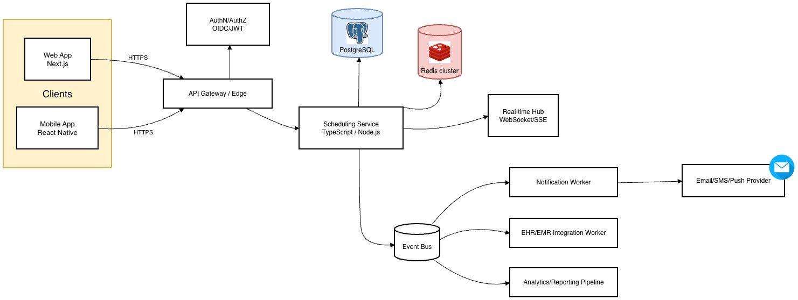
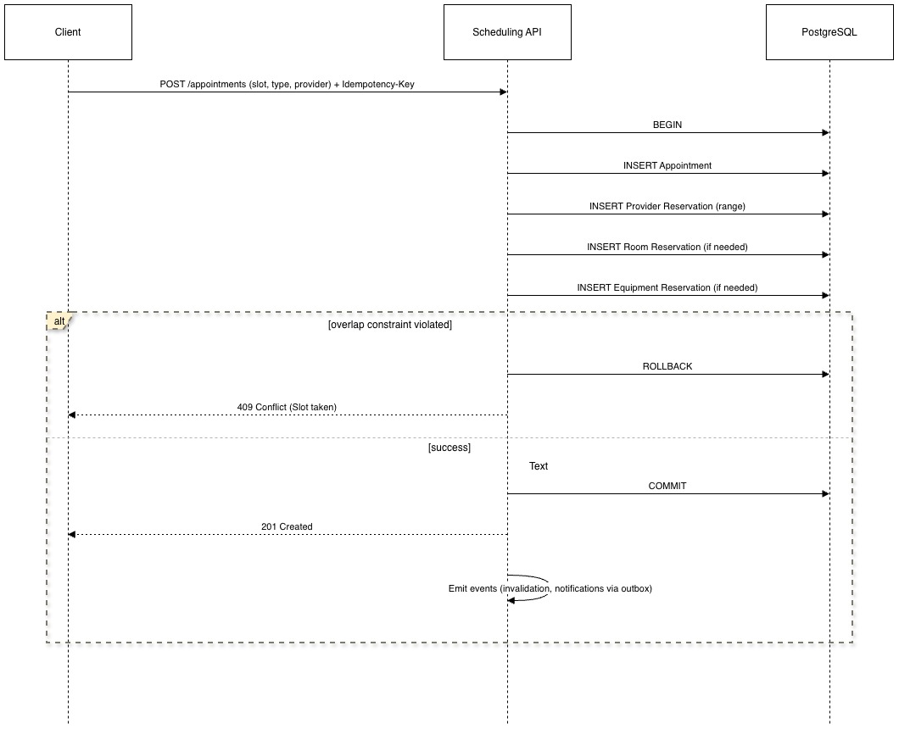
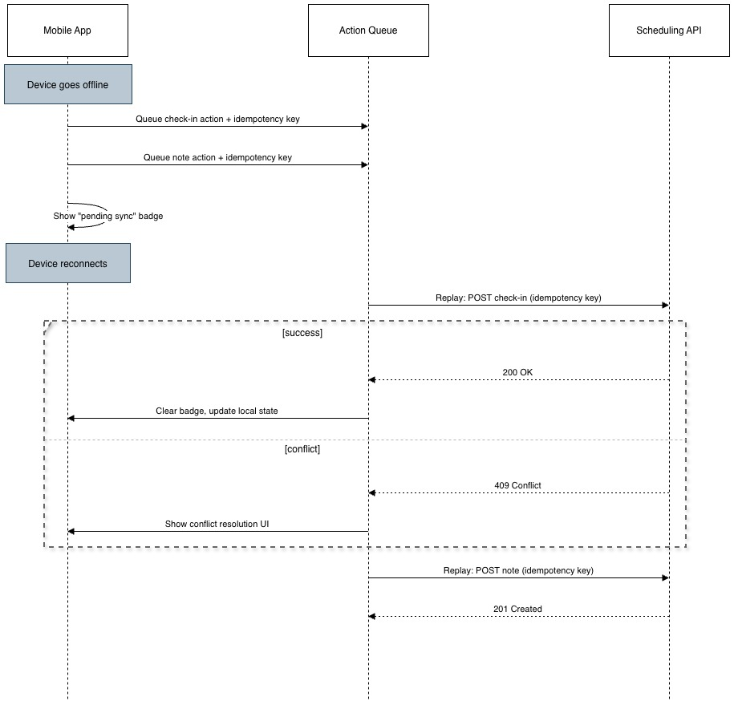

# Multi-Clinic Appointment Scheduling System — Technical Design (Assignment 4)

## 1. System Overview

### 1.1 Problem Statement

Design a scheduling system for a healthcare organization that:

* Supports **500 clinics**
* Handles **50,000 appointments/day**
* Supports **real-time availability updates**
* Works across **web + mobile**
* Handles **complex scheduling rules**:

  * provider availability
  * room booking
  * equipment constraints
  * buffers (before/after)
  * preferences and exceptions

Healthcare scheduling is less about "calendar UI" and more about **correctness under concurrency**, **auditability**, **time-zone correctness**, and **patient safety**. A "mostly correct" scheduler is not acceptable: double bookings or incorrect availability directly impacts care delivery.

### 1.2 Goals

**Functional**

* Create/reschedule/cancel appointments.
* Show availability for providers and clinics in near real-time.
* Enforce resource constraints (provider/room/equipment).
* Support appointment types with different durations and buffer rules.
* Support exceptions (PTO, holidays, maintenance blocks).

**Non-functional**

* **Correctness**: prevent double-booking under all conditions.
* **Low latency**: availability queries ≤200ms p95 (cached), ≤500ms (cold).
* **Resilience**: degraded behavior must still be safe — never silently double-book.
* **Observability**: trace and audit all scheduling changes.
* **Security & privacy**: tenant isolation, minimize PHI exposure, least privilege, audit logs.

### 1.3 Key Design Principle

**Appointments and resource reservations are the source of truth. Availability is a derived projection.**

Availability changes whenever:

* a new appointment is booked,
* an appointment is moved/cancelled,
* rules or exceptions change,
* a room/equipment becomes unavailable.

Therefore, I treat "availability" as a computed view built from:

* schedule rules (recurring availability),
* exception rules,
* buffers and constraints,
* existing reservations.

### 1.4 Capacity Planning (Back-of-Envelope)

Before choosing architecture, the numbers:

* **50,000 appointments/day** across 500 clinics → ~100 appointments/clinic/day.
* Average booking rate: ~0.6 writes/sec. Not high in throughput terms.
* **Peak load**: clinics open 8am–5pm local time across ~4 US time zones → effective booking window ~12 hours. Peak is Monday mornings: expect 3–5× average → ~2–3 writes/sec peak. Still modest.
* **Availability queries are the real load driver**: each booking attempt may trigger 5–20 availability queries (browsing providers, dates, times). At peak: **30–60 availability reads/sec**. Each query computes slots from rules + reservations, touching multiple DB rows.
* **DB size**: ~50k appointments/day × 365 = ~18M appointments/year. Each appointment generates 1–3 reservations → ~36–54M reservation rows/year. With indexes, this is well within a single Postgres instance for 2–3 years before partitioning becomes critical.
* **WebSocket connections**: assuming 2–3 concurrent schedulers per clinic → ~1,000–1,500 active connections. A single WebSocket server handles this easily; can horizontally scale with sticky sessions or Redis pub/sub fanout.

**Conclusion**: a single well-indexed Postgres primary with read replicas, Redis caching, and horizontally scaled stateless API nodes handles this comfortably. The architecture is designed to scale further (partitioning, sharding) but doesn't need it at launch.

### 1.5 High-Level Architecture

* **Scheduling API** (stateless, horizontally scaled): handles CRUD on appointments and rules, computes availability.
* **PostgreSQL**: system-of-record for appointments, reservations, rules, audit logs.
* **Redis**: short-lived caching for availability, idempotency keys, rate limiting, pub/sub.
* **Event Bus + Workers**: outbound side effects (notifications, EHR sync, analytics) via transactional outbox for reliable delivery.
* **Real-time channel (WebSocket/SSE)**: publish invalidation signals to connected clients.
* **Web + Mobile clients**: consume REST APIs, subscribe to real-time updates.

#### System diagram



### 1.6 Technology Choices

| Choice | Why | Trade-off |
|---|---|---|
| **TypeScript (Node.js)** | Shared types with web/mobile clients; strong ecosystem for APIs, validation, testing | Less raw throughput than Go/Java; mitigated via caching + horizontal scale |
| **PostgreSQL** | Transactional guarantees, range types, exclusion constraints for "no overlap" — the most critical requirement | Write scaling requires partitioning later; acceptable given capacity analysis |
| **Redis** | Fast availability caching, idempotency keys, rate limiting, pub/sub for real-time invalidation | Never a correctness dependency — system must remain safe when Redis is down |
| **WebSockets** | Bi-directional (enables future collaborative scheduling, presence indicators) | More complex than SSE; fallback to SSE for simpler deployments |
| **Transactional Outbox** | Guarantees side effects (notifications, EHR sync) are delivered even if worker crashes mid-processing | Adds a polling/CDC mechanism; acceptable complexity for reliability |

### 1.7 Integration Points

* **Identity / SSO**: OIDC provider (Okta/Auth0/Azure AD) for staff authentication.
* **EHR/EMR**: HL7 FHIR or vendor APIs for patient/provider context and appointment sync.
* **Messaging**: email/SMS/push providers for reminders and changes.
* **Analytics**: event stream for scheduling metrics and utilization dashboards.

---

## 2. Data Model

### 2.1 Core Entities & Relationships

* **Clinic** — has timezone, policies, resources.
* **Provider** — belongs to one or more clinics.
* **Room** — belongs to clinic.
* **Equipment** — belongs to clinic, may have capacity > 1.
* **AppointmentType** — duration, buffer rules, resource requirements.
* **Appointment** — patient + provider + scheduled time + status.
* **Reservation** — blocks provider/room/equipment time windows (source of "no overlap" constraint).
* **ScheduleRule** — recurring working hours (provider and/or room).
* **ScheduleException** — overrides (PTO, holiday, maintenance).
* **AuditLog** — immutable record of all changes.

Key relationship: every appointment maps to **one or more reservations** — provider reservation (always), room reservation (if in-person), equipment reservation (if required by appointment type).

### 2.2 PostgreSQL Schema (conceptual)

#### Clinic

* `id (uuid)`, `name`, `timezone` (IANA string, e.g. "America/New_York"), `created_at`

#### Provider

* `id (uuid)`, `clinic_id` (FK), `name`, `specialty`, `active` (bool)

#### Room

* `id (uuid)`, `clinic_id` (FK), `name`, `capacity` (default 1 for exam rooms)

#### Equipment

* `id (uuid)`, `clinic_id` (FK), `name`, `capacity` (e.g., 2 infusion pumps)

#### AppointmentType

* `id (uuid)`, `clinic_id` (FK), `name`, `duration_minutes`, `buffer_before_minutes`, `buffer_after_minutes`
* `mode` (`in_person | telehealth | phone`), `requires_room` (bool), `required_equipment_ids` (join table)

#### Appointment

* `id (uuid)`, `clinic_id` (FK), `patient_id`, `provider_id` (FK), `appointment_type_id` (FK)
* `start_time_utc (timestamptz)`, `end_time_utc (timestamptz)`
* `status` (`scheduled | cancelled | completed | no_show | checked_in | in_progress`)
* `reason`, `created_at`, `updated_at`

#### Reservation

* `id (uuid)`, `clinic_id` (FK), `resource_type` (`provider | room | equipment`), `resource_id`
* `time_range_utc` (`tstzrange`) ← critical for overlap detection
* `appointment_id` (FK), `created_at`

#### ScheduleRule (recurrence)

* `id (uuid)`, `clinic_id` (FK), `resource_type`, `resource_id`
* `day_of_week` (0–6), `start_local_time`, `end_local_time`
* `effective_from`, `effective_to` (date range for rule validity)

#### ScheduleException

* `id (uuid)`, `clinic_id` (FK), `resource_type`, `resource_id`
* `start_time_utc`, `end_time_utc`, `type` (`pto | holiday | maintenance | custom_block`), `note`

#### AuditLog

* `id (uuid)`, `clinic_id`, `actor_user_id`, `entity_type`, `entity_id`
* `action` (`create | update | cancel | reschedule`), `before` (jsonb), `after` (jsonb), `created_at`

### 2.3 Concurrency Guarantee: "No Overlap" via Exclusion Constraints

The most important invariant: **no two reservations for the same resource overlap**.

PostgreSQL exclusion constraints enforce this at the database level:

* `time_range_utc` is stored as `tstzrange(start, end)`
* Exclusion constraint:

  `EXCLUDE USING gist (resource_type WITH =, resource_id WITH =, time_range_utc WITH &&)`

For a given resource, ranges cannot overlap (`&&` operator). Even if two API servers race to book the same slot simultaneously, one INSERT will fail with a constraint violation — **correctness is enforced by the database, not application logic**.

### 2.4 Indexing Strategy (mapped to query patterns)

| Query Pattern | Index |
|---|---|
| Availability: "reservations overlapping date range for provider X" | `Reservation(resource_type, resource_id, time_range_utc)` — GiST |
| Weekly clinic view | `Appointment(clinic_id, start_time_utc)` — btree |
| Provider day view | `Appointment(provider_id, start_time_utc)` — btree |
| Rule lookup | `ScheduleRule(resource_type, resource_id, day_of_week)` — btree |
| Exception lookup | `ScheduleException(resource_type, resource_id, start_time_utc)` — btree |
| Audit trail | `AuditLog(entity_type, entity_id, created_at)` — btree |

---

## 3. Availability Engine

### 3.1 What "Availability" Means

A time slot is "available" if **all** required resources can be reserved for the appointment duration plus buffers:

* Provider is scheduled to work (per ScheduleRules)
* Provider has no conflicting reservation or exception
* If in-person: at least one suitable room is available
* If equipment required: equipment capacity supports the booking
* Slot respects clinic policies (minimum lead time, maximum advance booking window)

Availability is computed in the clinic's timezone but stored and enforced in UTC.

### 3.2 Slot Computation Algorithm

Inputs: `clinicId`, `providerId` (or group), `appointmentTypeId`, date range `[from, to]` in local time, optional constraints (roomId, equipment preferences).

**Steps:**

1. **Load scheduling rules** — provider working hours (recurring), room/equipment availability rules.

2. **Expand rules into candidate intervals** — e.g., "Mon 9–5, Tue 10–4" → concrete intervals for the requested date range.

3. **Apply exceptions** — subtract PTO, holidays, maintenance blocks.

4. **Compute effective duration** — `effective_duration = duration + buffer_before + buffer_after`

5. **Subtract existing reservations** — query reservations for provider/room/equipment overlapping the range. Remove occupied ranges from candidate intervals.

6. **Discretize into slots** — align to `slotDuration` grid (e.g., 15 minutes). For each candidate slot start, verify `[start - buffer_before, start + duration + buffer_after]` fits within available intervals.

7. **Return slots** — each slot includes local display times, UTC times (for booking), availability boolean, and optional reason if unavailable (for UI conflict hints).

### 3.3 Handling Concurrent Booking Attempts (Correctness)

The system must prevent double booking even under races, retries, and partial failures.

**Booking is a single database transaction:**

1. INSERT appointment
2. INSERT provider reservation (range includes buffers)
3. INSERT room reservation (if needed)
4. INSERT equipment reservation (if needed)
5. COMMIT

If any reservation INSERT violates the exclusion constraint → ROLLBACK → return `409 Conflict` ("slot no longer available").

This avoids the classic TOCTOU race: "check slot is free" then "book slot" with a gap in between.

#### Concurrency sequence



### 3.4 Complex Rules Support

The design supports complex rules by separating concerns:

* **Rules** — recurring availability (what's normally possible)
* **Exceptions** — one-off overrides (what's different today)
* **Constraints** — reservations + required resources (what's already taken)
* **Preferences** — ranking rather than hard constraint (what's preferred)

**Provider preferences**: "Prefer mornings" → rank morning slots higher but still allow afternoons. "Prefer room 204" → attempt preferred room first, fall back to others.

**Room/equipment capacity**: Most exam rooms are capacity 1 — one reservation fills them. For group sessions or shared equipment (e.g., 3 infusion pumps), I use a **sub-resource model**: capacity-N resources are expanded into N logical sub-resources (e.g., `pump:42#1`, `pump:42#2`, `pump:42#3`). Each sub-resource gets its own reservation row and participates in the same exclusion constraint. Assignment is first-available; sub-resources are treated as interchangeable. If sub-resources have meaningful differences (e.g., one pump is newer), they should be modeled as separate equipment entities rather than sub-resources — the distinction maps to whether the patient/provider cares which one they get. This approach is simpler and more correct than aggregation-based capacity counting, which requires careful transactional locking.

**Buffers**: buffer time is encoded in the reservation range (reservation range = buffer_before + clinical time + buffer_after). The appointment itself stores only the "clinical time" for display purposes. This means buffer enforcement is automatic — the exclusion constraint prevents bookings that would violate buffer periods.

**Clinic policies**: minimum lead time (e.g., no same-day booking after 4pm), maximum booking window (e.g., 180 days out). Enforced both in availability generation (don't show invalid slots) and in the booking API (reject attempts that bypass the UI).

### 3.5 Time Zone Handling (and DST)

**Storage**: all persisted timestamps in UTC (`timestamptz`). Reservations use UTC ranges.

**Computation**: scheduling rules are defined in **clinic local time** (e.g., "Mon 9–5"). For a query range, the engine converts the query window into clinic timezone, expands rules in local time, then converts concrete intervals to UTC for reservation overlap checks.

**DST edge cases**:

* Spring forward: some local times don't exist. Rule expansion must skip invalid times (e.g., 2:30am on spring-forward day).
* Fall back: local times may repeat. Use timezone-aware conversion that preserves correct UTC mapping with explicit disambiguation.

**UI rule**: web/mobile display times in the **clinic timezone** for staff schedulers. If patient-facing later, display in patient timezone with explicit labels (e.g., "3:00 PM ET").

---

## 4. API Design

### 4.1 API Style: REST (+ real-time channel)

REST is a good fit here: clear resources (appointments, rules, availability), natural caching semantics, simplicity for mobile clients. GraphQL could be added later for complex composed views, but the core complexity in this system is correctness and concurrency, not over-fetching.

### 4.2 Endpoints

#### Availability

* `GET /v1/availability`

  * query: `clinicId`, `providerId`, `appointmentTypeId`, `from` (ISO), `to` (ISO), optional `roomId`, `equipmentIds`
  * response:

    ```json
    {
      "timezone": "America/New_York",
      "slotDurationMinutes": 15,
      "slots": [
        {
          "id": "slot_...",
          "startLocal": "2026-02-16T09:00:00-05:00",
          "endLocal": "2026-02-16T09:30:00-05:00",
          "startUtc": "2026-02-16T14:00:00Z",
          "endUtc": "2026-02-16T14:30:00Z",
          "available": true
        }
      ]
    }
    ```

#### Appointments

* `POST /v1/appointments` — headers: `Idempotency-Key: <uuid>`, body: clinicId, patientId, providerId, appointmentTypeId, startUtc, optional notes/reason
* `PUT /v1/appointments/{id}` — reschedule, update reason
* `DELETE /v1/appointments/{id}` — soft cancel (preserves audit trail)
* `GET /v1/appointments` — filters: clinicId, providerId, roomId, from/to, status

#### Rules & Exceptions

* `GET /v1/providers/{id}/rules`
* `PUT /v1/providers/{id}/rules`
* `POST /v1/providers/{id}/exceptions`
* `DELETE /v1/exceptions/{id}`

### 4.3 Real-Time Updates (WebSocket/SSE)

Purpose: scheduler UI must refresh when availability changes without manual reload.

Model:

* Clients subscribe to channels: `clinic:{clinicId}`, `provider:{providerId}`
* Server emits events: `availability.invalidated` (date range + resources affected), `appointment.created|updated|cancelled`

Clients react by invalidating TanStack Query cache entries and refetching relevant queries. This avoids sending full availability payloads through the real-time channel — real-time messages serve as **cache invalidation signals**, which is simple and scalable.

### 4.4 Rate Limiting

Availability queries can be high volume (users scrolling weeks, browsing multiple providers).

* Per user: 60 req/min for availability endpoints
* Per clinic: global caps to prevent bug-induced floods
* Stricter on any unauthenticated endpoints (if patient-facing booking added later)

Implementation: Redis token bucket keyed by `userId + route`. Fallback to in-process token bucket if Redis is unavailable.

### 4.5 Caching Strategy

**Cache what is expensive and safe to cache: availability results**, not PHI-heavy objects.

* Cache key: `availability:{clinicId}:{providerId}:{appointmentTypeId}:{dateBucket}:{version}`
* TTL: short (30–120 seconds)
* Invalidation: on appointment create/reschedule/cancel, bump a version counter for affected provider/clinic/day in Redis and publish invalidation event via real-time hub

Cache is an optimization only. If Redis is down, compute from PostgreSQL directly — slower but still correct.

---

## 5. Frontend Architecture

### 5.1 Web + Mobile Structure

* Web: Next.js app router (scheduler, admin, reporting).
* Mobile: React Native (provider schedule view and day-of actions).
* Shared monorepo package:

  * API client (typed fetch wrappers)
  * Domain types (appointment, reservation, slot)
  * Validation schemas (zod — used both for UI forms and API request validation)
  * Time utilities (timezone-safe formatting, slot display helpers)

This prevents type drift between platforms and ensures business rules (e.g., "is this slot in the past?") are defined once.

### 5.2 State Management

Principle: split state by source of truth:

* **Server state** (fetched, cached, invalidated) → TanStack Query. Scheduling UIs involve many queries and refetches; TanStack Query provides caching, retries, request deduplication, and programmatic invalidation — all essential for a scheduler.
* **UI state** (local selections, drag position, modal open/close) → React state/hooks.
* **Global app state** (auth/session, feature flags) → minimal context or store.

### 5.3 Optimistic Updates & Collaborative Scheduling

Rescheduling is UX-critical (drag & drop on calendar).

**Optimistic update flow:**

1. User drops appointment on new slot → UI immediately reflects the move.
2. Send `PUT /appointments/{id}` with `Idempotency-Key`.
3. If backend returns `409 Conflict`:
   * Roll back UI to previous position.
   * Show "slot taken" notification and trigger an availability refetch to propose nearest open slots.

Optimism is safe because correctness is enforced server-side by the exclusion constraint.

**Collaborative scheduling challenge**: when multiple schedulers work the same provider's calendar simultaneously, they can see stale availability. The real-time WebSocket channel mitigates this: when Scheduler A books a slot, the invalidation event reaches Scheduler B's client within seconds, triggering a refetch. For high-contention scenarios (e.g., one provider with very limited availability), the UI can additionally show a **soft lock indicator** — a "someone is viewing this slot" hint via WebSocket presence, not a hard lock — to reduce wasted attempts. This is a progressive enhancement: the system is correct without it, but it improves UX under contention.

### 5.4 Offline Support Strategy (Mobile)

Mobile must handle intermittent connectivity (providers moving between exam rooms, poor hospital Wi-Fi).

* Cache "today + next 2 days" schedule locally (SQLite via WatermelonDB or similar).
* Queue write actions when offline: check-in, add note, cancel request, reschedule request.
* Each queued action includes an idempotency key, intended change, and timestamp.
* Sync on reconnect:

  * Replay queued requests in order.
  * Handle conflicts: reschedule conflicts → show conflict UI for user resolution. Check-in conflicts → server decides based on appointment status progression rules (e.g., can't check-in a cancelled appointment).

* Show a **"pending sync" badge** on queued actions — offline must never lead to silent data loss.

#### Offline sync flow (Mermaid)



### 5.5 Shared Code and Type Safety

* Generate API types from shared domain models (single source of truth for types).
* Validate inputs with zod schemas at boundaries: UI form validation and backend request validation use the same schemas.
* Goal: no "stringly typed" scheduling logic — appointment status transitions, time formatting, and validation are type-checked.

---

## 6. Security & Multi-Tenancy

### 6.1 Multi-Tenant Isolation

With 500 clinics, tenant isolation is critical — Clinic A must never see Clinic B's data.

**Strategy: application-enforced tenant isolation with `clinic_id` on every row.**

* Every table with patient or scheduling data includes `clinic_id`.
* All queries include `WHERE clinic_id = :currentClinicId`, enforced by a middleware layer that extracts the tenant from the authenticated JWT.
* **PostgreSQL Row-Level Security (RLS)** as a defense-in-depth layer: even if application code has a bug that omits the `clinic_id` filter, RLS policies prevent cross-tenant data access at the database level.

  ```sql
  ALTER TABLE appointments ENABLE ROW LEVEL SECURITY;
  CREATE POLICY clinic_isolation ON appointments
    USING (clinic_id = current_setting('app.current_clinic_id')::uuid);
  ```

* Multi-clinic staff (e.g., floating providers) have explicit `provider_clinic` memberships; they can only access clinics they belong to.

### 6.2 PHI Protection

* **Encryption at rest**: Postgres with volume-level encryption (managed DB services provide this by default). Application-level encryption for highly sensitive fields (SSN) if stored.
* **Encryption in transit**: TLS everywhere — API gateway, database connections, Redis connections, inter-service communication.
* **Minimize PHI in logs**: application logs use opaque IDs (patient_id, appointment_id), never names, DOBs, or medical details. A secure lookup tool allows authorized staff to resolve IDs when debugging.
* **Audit logs** capture all data access and mutations with actor identity, timestamp, and before/after state — required for HIPAA compliance.
* **Session management**: short-lived JWTs (15 min), refresh token rotation, automatic logout on inactivity.

### 6.3 Authorization Model

Role-based access control (RBAC) with clinic-scoped roles:

* **Scheduler**: can view/create/modify appointments within their clinic(s).
* **Provider**: can view their own schedule, check-in patients, add notes.
* **Admin**: can manage rules, exceptions, rooms, equipment for their clinic.
* **System Admin**: cross-clinic access for support and configuration.

Permissions are checked at the API layer before any database access.

---

## 7. Scalability & Reliability

### 7.1 Scaling with Clinic Count

Per the capacity analysis (Section 1.4): 50k appointments/day is moderate throughput, but availability queries at peak can reach 30–60 reads/sec, and real-time connections scale with concurrent users.

* **Stateless API**: horizontal scaling behind load balancer. Add nodes to handle availability query load.
* **Postgres**: primary for writes + read replicas for read-heavy views (appointment lists, dashboards, reporting).
* **Redis**: clustered/managed for caching and rate limiting.
* **Async workers**: scale independently based on event backlog.

### 7.2 Database Scaling Strategy

**Phase 1 (launch):** Single Postgres primary (managed HA). Strong indexes for reservation overlap + appointment time queries. This handles the initial scale comfortably.

**Phase 2 (growth):** Add read replicas for appointment lists, reporting, dashboards. Keep all writes on primary — booking must never hit replicas.

**Phase 3 (scale):** Partition `reservations` and `appointments` by month (range partitioning on `start_time_utc`). Old partitions can be moved to cheaper storage or archived. If clinic count grows to thousands, consider partitioning by `clinic_id` range or migrating to Citus for distributed Postgres.

### 7.3 Caching Layers

* **L1**: client-side query cache (TanStack Query) — zero latency for repeated requests within a session.
* **L2**: Redis availability cache — shared across API instances, short TTL, versioned invalidation.
* **Static content**: CDN for web assets. Never cache PHI responses at the edge without strict controls.

### 7.4 Failure Modes & Recovery

| Failure | Impact | Recovery |
|---|---|---|
| **Redis outage** | Slower availability (cache miss every time), no rate limiting, no real-time invalidation | Compute from Postgres directly; UI falls back to polling; in-process rate limiter as temp protection |
| **Postgres failover** | Brief unavailability of writes | Idempotency keys prevent double booking on retry; retry only on transient errors |
| **Real-time channel down** | Stale availability in UI | UI continues to function via polling; refetch on user actions |
| **Race condition / double booking** | N/A — prevented by design | DB exclusion constraint rejects overlap; multiple servers can safely race |
| **Notification worker failure** | Delayed notifications | Transactional outbox ensures messages are retried until delivered; no appointment data loss |

### 7.5 Data Consistency Model

* **Strong consistency** for booking operations (transactional, single primary).
* **Eventual consistency** for notifications, analytics, EHR sync.

This prioritizes safety: the system never tells two people they both successfully booked the same slot.

---

## 8. Observability

### 8.1 Logging Approach

Structured JSON logs with: `request_id` (correlation), `user_id`, `clinic_id`, `appointment_id` (when relevant), route name, status code, latency, error codes.

Rules:

* **Never log PHI** (patient names, DOB, medical details) in application logs.
* Use stable identifiers and secure lookup tools when debugging.

### 8.2 Metrics to Track

**API**: request latency p50/p95/p99, error rate by endpoint, 409 conflict rate (booking collisions — a leading indicator of contention and UX issues).

**Availability engine**: compute latency on cache miss, cache hit ratio, slots computed per request (detects runaway date ranges).

**Database**: transaction time, lock wait time, constraint violation counts, slow query stats.

**Real-time**: active WebSocket connections, message delivery latency, dropped event count.

### 8.3 Alerting Strategy

Alerts should be actionable — every alert has a clear owner and response playbook:

* Booking conflict rate spikes suddenly → possible bug, unusual contention, or UI issue.
* Availability compute latency exceeds threshold for sustained period → cache miss storm or DB degradation.
* DB lock waits or deadlocks increase → query pattern issue or contention hot spot.
* Outbox backlog growth → notification worker is down or downstream provider is failing.
* Elevated 5xx rate → general system health alarm.

### 8.4 Debugging Tools

* **Audit log** for all appointment changes: who changed what, when, before → after state. This is both a debugging tool and a compliance requirement.
* **Replayable requests** (redacted of PHI) linked by `request_id` for tracing failures across services.
* **Admin "slot explanation" endpoint** (restricted to admin roles): given a provider, slot time, and appointment type, returns a structured explanation of why the slot is unavailable — provider exception, overlapping reservation, no room available, equipment constraint, or policy violation. Invaluable for support staff and eliminates guesswork when clinics report "I can't see any availability."

---

## 9. Rollout Strategy

### 9.1 Phased Deployment

Rolling out to 500 clinics simultaneously is risky. A phased approach:

**Phase 1 — Pilot (2–3 clinics):** Deploy to a small group of friendly clinics. Validate correctness, identify UX issues, tune availability computation performance, and establish operational baselines.

**Phase 2 — Regional rollout (50 clinics):** Expand to a region. Monitor for scale-related issues (DB load, cache hit ratios). Use feature flags to control which clinics are on the new system vs. legacy.

**Phase 3 — Full rollout:** Migrate remaining clinics in batches (50–100 at a time). Keep legacy system running in parallel during migration window. Each clinic's migration includes data import, staff training, and a validation period.

### 9.2 Feature Flags

Feature flags control:

* Which clinics use the new scheduling system vs. legacy.
* Progressive feature enablement (e.g., WebSocket real-time updates can be enabled per-clinic after validating connectivity).
* Quick rollback: disable new system for a clinic and revert to legacy without a deployment.

---